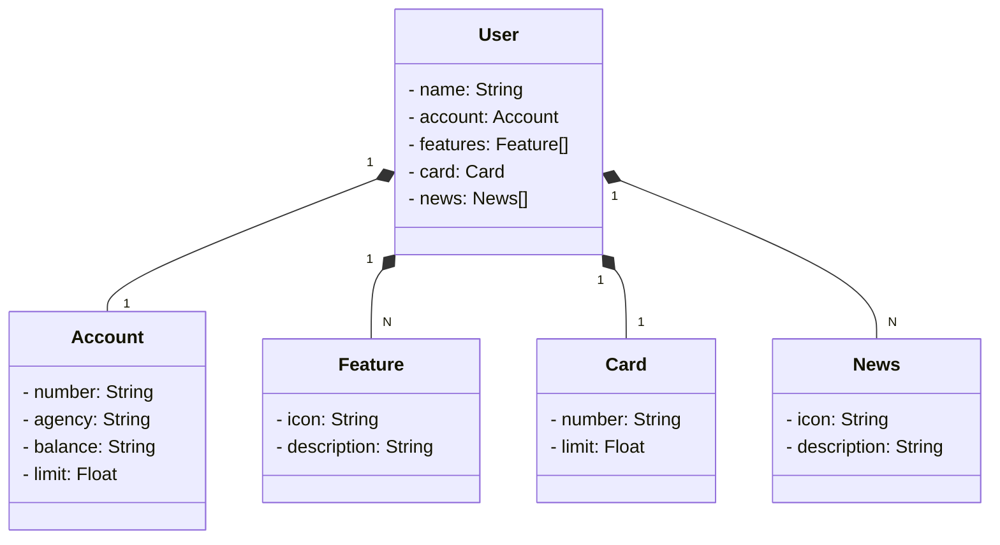

# Santander Dev Bootcamp Back-end Java

Java RESTful API criada para o Santander Bootcamp

## Diagrama de classes

```mermaid
classDiagram
  class User {
    - name: String
    - account: Account
    - features: Feature[]
    - card: Card
    - news: News[]
  }

  class Account {
    - number: String
    - agency: String
    - balance: String
    - limit: Float
  }

  class Feature {
    - icon: String
    - description: String
  }

  class Card {
    - number: String
    - limit: Float
  }

  class News {
    - icon: String
    - description: String
  }

  User "1" *-- "1" Account
  User "1" *-- "N" Feature
  User "1" *-- "1" Card
  User "1" *-- "N" News

```
